<h1 align="center">Ivan Sostaric</h1>

<p align="center">
  <a href="https://www.uoguelph.ca/">
    <picture>
      <source media="(prefers-color-scheme: dark)" srcset="./assets/branding/university-of-guelph-wordmark-dark-v1.png">
      <source media="(prefers-color-scheme: light)" srcset="./assets/branding/university-of-guelph-wordmark-light-v1.png">
      
    </picture>
  </a>
</p>

<p align="center">
  Major in Computer Science + AI<br>
  Minor in Business
</p>

<p align="center">
  <a href="https://www.linkedin.com/in/ivansost/"></a>
  <a href="https://www.ivansostaric.com"></a>
  <a href="https://www.ivansostaric.com/Ivan_Sostaric_Resume.pdf"></a>
  <a href="mailto:ivansostaric64@gmail.com"></a>
</p>

I'm pursuing a Bachelor of Computing in Computer Science at the University of Guelph, specializing in Artificial Intelligence with a Business minor. My background combines software engineering, data analytics, and AI, with a focus on building full-stack applications with robust architecture, scalable backends, and intuitive frontends. The intersection of AI and business is also a key interest of mine, especially using data, automation, and intelligent systems to improve decision-making, create better products, and turn technical ideas into practical value.

### Currently · Summer Intern at Bank of Montreal

<p>
  <picture>
    <source media="(prefers-color-scheme: dark)" srcset="./assets/branding/current-role-label-dark-v4.svg">
    <source media="(prefers-color-scheme: light)" srcset="./assets/branding/current-role-label-light-v4.svg">
    
  </picture>
  Currently, as an Anti-Money Laundering Investigator Intern at Bank of Montreal, I’m transforming routine work, such as transaction analysis of large datasets in Excel and repetitive Word document reporting, by prompt engineering workflows that improve efficiency using the latest AI models and agents.
</p>

<br clear="all">

### Selected work

- **[GitZero](https://github.com/Ivansost/gitzero)** — explainable CLI and ML tooling for detecting signals of AI-assisted code.
- **[AML Network Analytics](https://www.ivansostaric.com/projects/aml)** — transaction graph analysis with SQL, NetworkX, risk scoring, and Power BI.
- **[Credit Risk Analysis](https://github.com/Ivansost/Credit-Risk-Scoring)** — Random Forest credit-risk model trained on 30,000 customer records.
- **[TravelPal](https://github.com/Ivansost/gdschacks25)** — AI-powered sustainable trip planner built with Next.js, Gemini, and Convex.

### Technical Skills

<!-- Icons sourced from theSVG (MIT) and normalized for this README: https://thesvg.org/ -->
<p align="center">
  <strong>Languages</strong><br>
     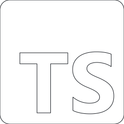 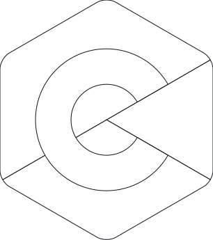 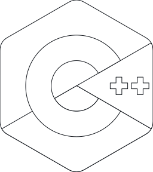 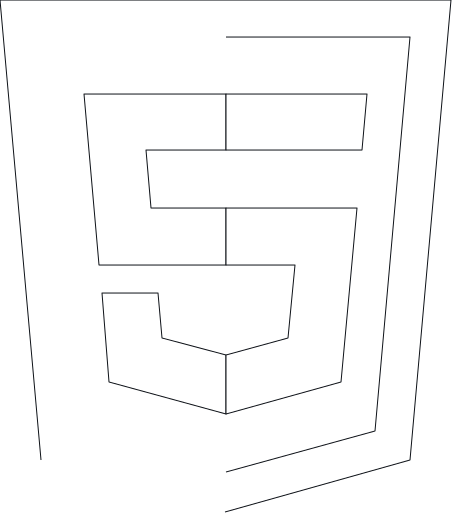 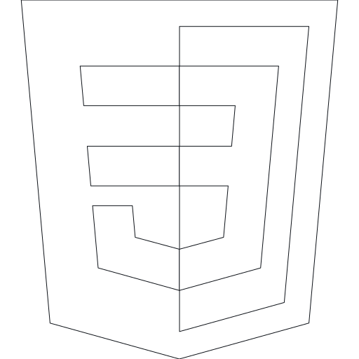 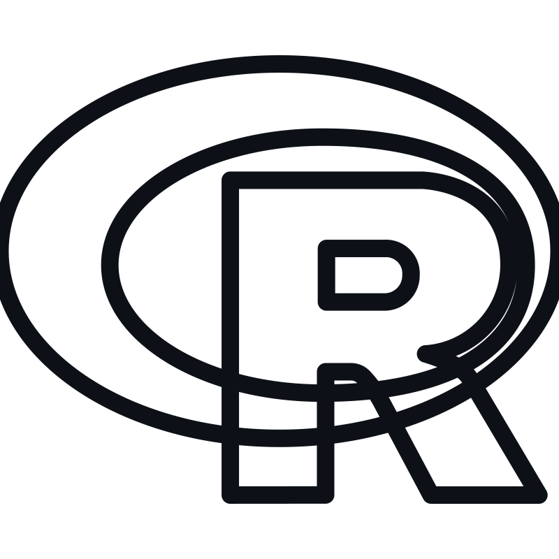<br>
  <sub>Python · Java · SQL · JavaScript · TypeScript · C/C++ · HTML/CSS · R</sub>
</p>

<p align="center">
  <strong>Web & APIs</strong><br>
   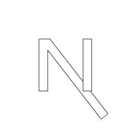 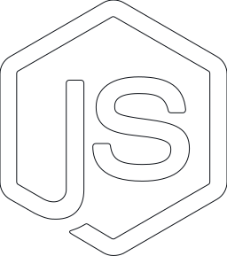 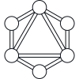 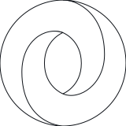 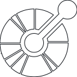<br>
  <sub>React · Next.js · Node.js · REST APIs · GraphQL · JSON · API Design</sub>
</p>

<p align="center">
  <strong>Data & AI</strong><br>
      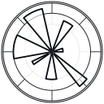<br>
  <sub>Pandas · NumPy · scikit-learn · PyTorch · Matplotlib · Machine Learning · Data Pipelines</sub>
</p>

<p align="center">
  <strong>Cloud & Databases</strong><br>
     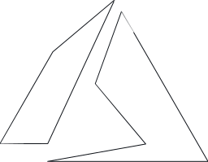  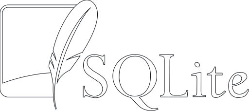 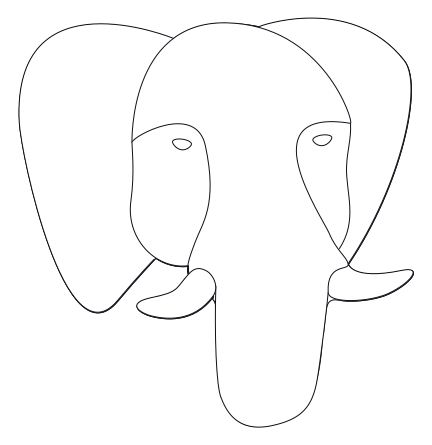<br>
  <sub>AWS Lambda · Amazon RDS · Azure · Databricks · SQLite · PostgreSQL</sub>
</p>

<p align="center">
  <strong>Tools & Practices</strong><br>
  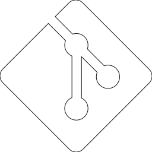     <br>
  <sub>Git · Docker · Power BI · Tableau · Jira · SDLC · Agile/Scrum · Unit Testing</sub>
</p>

### Stats

<!-- PROFILE-STATS:START -->
```text
11 public repositories  ·  15 unique NeetCode problems solved
```
<!-- PROFILE-STATS:END -->

<sub>Updated automatically from GitHub and my NeetCode submissions.</sub>
